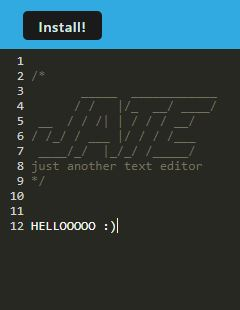

# PWAPWA

## Description

A text editor that runs in the browser and is a single-page application which meets the progressive web applications (PWA) criteria.

This assignment was one of the easier ones that I've had to do but I think that's only because I was able to accesss previous in-class assignments and tutoring. I was able to complete filling out the TO-DOs on my own but not without error! Though, I was really relieved to find out that I was only missing one necessary part (my swSRC parameter) for it to run though. I was really motivated by my desire to figure out the TypeError that my terminal kept giving me.

## Installation

Just press the "Install!" button and download it!

The deployed application should look something like this:

[Click this for the deployed application.](https://shrouded-plains-12257-307f434c1ab0.herokuapp.com/)

## Credits

* I was assisted by Dennis Itua who was tutoring me and helping me define swSRC by linking it to my src-sw.js file.
* I did not author the starter code and I cloned it from the repository, [cautious-meme](https://github.com/coding-boot-camp/cautious-meme). This starter code is found widely throughout my repository.
* I referenced this [stack overflow forum](https://stackoverflow.com/questions/61834789/throw-new-typeerrorinvalid-schema-configuration-name-is-not) for my schema configurations.
* I sourced code from [PWA Workshop](https://pwa-workshop.js.org/5-pwa-install/#installing-the-pwa) for my install.js file.

## License

N/a
